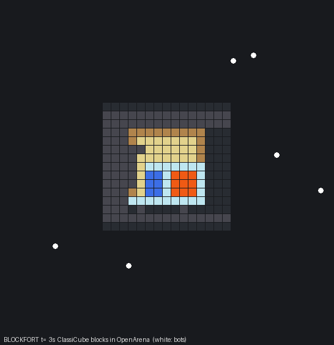

# Quake 3 / OpenArena: recompile, reverse engineer, mash up with ClassiCube

The CHIP-8 experiment one level up: a real shipped game. OpenArena 0.8.8 (GPL engine and data) runs Quake 3's game
logic as QVM bytecode (`qagame.qvm`). The pipeline below recompiles that binary to C, finds the functions a mod needs
in the stripped binary, and links a second game's real code into it: ClassiCube's block physics (classic Minecraft
rules; BSD). Every step is checked against something independent rather than by eye.

```
qagame.qvm --qvmrecomp.py--> C --gcc--> qagame_aot.so --(ioq3 + patch: QVM_AOT)--> same game, native
     |                                       ^ difftest: whole VM image + syscall stream hashed after every call
     +--qvm_re.py--> re.json (G_Damage, G_RadiusDamage, g_entities ...) --grade_re.py--> 17/17 vs real symbols
                         |
                         +--gen_symbols.py--> hooks --> blockfort.c + ClassiCube's BlockPhysics.c ... = BLOCKFORT
```

| Step | Files | Result |
|---|---|---|
| Deterministic headless matches | `ioq3-aot.patch`, `run_match.sh`, `setup.sh` | 3 interpreter runs bit-identical; 60 s of play in 2.2 s |
| Static recompiler | `qvmrecomp.py`, `build_aot.sh` | identical to the interpreter on every call, 3 game modes x 5 min ([results](results/recomp_difftest.txt)) |
| Test the test | `mutate.py`, `--coverage` | 11/11 non-equivalent mutants caught |
| RE of the stripped binary | `qvm_re.py`, `grade_re.py` | 17/17 correct vs symbols rebuilt from GPL source ([results](re_grade.txt)) |
| Mashup | `blockfort/` | ClassiCube blocks are solid, breakable, burn and blow up inside OpenArena ([results](results/)) |



## 1. Making a real game testable

A difftest needs bit-identical runs, and stock ioquake3 is not deterministic. The patch (`ioq3-aot.patch`, all behind
environment variables) fixes the five sources found, each by first watching the control run diverge:

1. `srand(time)`, the GAME_INIT random seed, `trap_Milliseconds` and `trap_RealTime` read the wall clock
   (`QVM_DETERMINISTIC`).
2. Parallel runs shared a home directory: a written `q3config.cfg` changed the cvar registration order, so cvar
   handles in VM memory differed.
3. Port collisions (`net_enabled 0`): the retry path registers cvars in a different order.
4. **`VM_Call` reads 12 varargs whatever the caller passed**, and both backends copy them into VM memory. When a bot
   thinks, the engine re-enters the VM with one argument, and 11 slots of host-register garbage land in the VM stack.
   This is a real (harmless) ioq3 quirk. Fixed with a macro that zero-pads every `VM_Call`.
5. Frames waited for the wall clock. `QVM_FAST` runs them back to back with `fixedtime 50` (game time per frame
   unchanged, verified identical): a 5-minute match takes about 2.5 s.

## 2. Static recompilation (`qvmrecomp.py`)

Each QVM function becomes a C function. The operand stack becomes C locals, sized by abstract interpretation of stack
depth. VM memory stays the engine's own data image, so syscalls and pointers work unchanged. To be *byte-identical*
to `vm_interpreted.c`, the C also writes what the interpreter writes into VM memory: expanded-code return addresses,
syscall numbers in the stack slot, masked loads and stores, x86's 5-bit shift-count masking, and `cvttss2si`'s
64-bit float-to-int behaviour.

Two real-world problems came up, the same kinds N64/360 recompilers hit:
- **Jump tables.** OpenArena's `jtrg` segment (meant to list them) is wrong in the shipped binary: it points into the
  middle of expressions. The recompiler instead pattern-matches lcc's `CONST table; ADD; LOAD4; JUMP` and reads the
  bounds from the preceding `LTI`/`GTI`. In one case lcc kept the lower bound in a temporary, so the table is walked
  down from the maximum.
- **Indirect calls** (`ent->think`, `ent->die` ...) go through a dispatch switch over all 1,128 function entries.

Is a 12,022/12,022 match meaningful? Only 28% of instructions run in a match, and a first mutation test caught
just 9 of 12 single-operator mutants, because some wrong values never persist in VM memory (temporaries, or
arguments sent to the engine). Adding a running hash of the syscall stream raised it to 11/12. The last survivor is
provably equivalent in FFA: both sides of the flipped branch return 0.

Speed: the recompiled module matches ioq3's JIT (2.5 s vs 2.4 s for a full 5-minute server run; interpreter 7.5 s).
The point is not speed. It is readable, hookable C with a proof of equivalence.

## 3. Reverse engineering the stripped binary (`qvm_re.py`)

Ghidra has no QVM processor (see [../TOOLS.md](../TOOLS.md)), so this is the hand-rolled equivalent of a Ghidra MCP
session: disassembler, call graph, string/syscall/function-pointer references, parameter counts. The rules use only
the binary and the public engine ABI (`g_public.h` syscall numbers), and each identification records its evidence. Examples:

- **G_Damage**: the one 8-argument function called by all 5 `trap_EntitiesInBox` users that deal damage.
- **G_RadiusDamage**: of those 5, the only one with 6 parameters that calls a `trap_Trace` line-of-sight helper
  (which is then **CanDamage**). Before parameter recovery was added, this rule matched 5 functions.
- **G_ExplodeMissile**: the function pointer `fire_rocket` stores (`ent->think`) that calls G_RadiusDamage.
- **g_entities**: OpenArena never passes it as a constant. `trap_LocateGameData`'s first argument is loaded from
  `level.gentities`, and the address is the constant `G_InitGame` stores there. Its size argument (816) matches
  the size computed from the GPL headers with `gcc -m32`, and `blockfort.c` asserts that at compile time.

**Grading.** OpenArena's gamecode history contains commit `ddb8819` (Nov 2011). Built with q3lcc, it gives
a QVM with *the same data, literal and BSS sizes* as the shipped one (14 instructions shorter), plus a symbol map.
Aligning functions by opcode shape matches 1126/1128 exactly. Result: **17/17 identifications correct**
([re_grade.txt](re_grade.txt)). One "wrong" answer along the way was a grader bug: q3asm map addresses are
segment-relative.

## 4. BLOCKFORT: ClassiCube's block world inside OpenArena

`blockfort/` links **ClassiCube's own code, unmodified**, into the recompiled game: `BlockPhysics.c`, `Lighting.c`,
`World.c`, `Block.c`, `GameVersion.c`, `Generator.c` and others. A small shim (`cc_stubs.c`, `cc_vars.c`) replaces
platform, UI and renderer calls and aborts if any unexpected one is reached. The bridge (`blockworld.c`) drives it
only through ClassiCube's singleplayer entry points: `Game_ChangeBlock` and then `Physics_OnBlockChanged` for edits,
and `Physics_Tick` at 20 Hz, the same rate as the Quake server frame.

The hooks (`blockfort.c`) sit on the two functions the RE found, via `qvmrecomp.py --hook`. They call the game's own
recompiled G_Spawn, G_FreeEntity, G_Damage and G_RadiusDamage, so damage, kills and scores go through OpenArena's
normal code. A fort (plank walls, sandbag roof, glass water and lava tanks, TNT in the corners) is built around the
map's rocket launcher. Mechanics run both ways:

| Direction | Mechanic |
|---|---|
| Minecraft → Quake | solid blocks are solid entities (one per vertical run): they stop players and missiles |
| Quake → Minecraft | every explosion breaks blocks within half its splash radius, unless ClassiCube's own TNT rule says the block resists (stone, metal, liquids) |
| Quake → Minecraft → Quake | TNT in a blast is re-placed, which runs ClassiCube's TNT handler; the detonation is also a Quake explosion credited to whoever set it off, so TNT can chain |
| Minecraft → Quake | sand/gravel landing on a player crushes them (MOD_CRUSH); lava burns (MOD_LAVA) |
| Quake → Minecraft | at build time every cell is probed with `trap_PointContents`; cells inside the map's walls become bedrock, so the two worlds agree on geometry. Before this fix, lava flowed straight through Quake walls (1068 lava cells at the end vs 523 after) |

**Checks** ([results/blockfort_checks.txt](results/blockfort_checks.txt), `run_experiment.sh`):

- **A. The hook layer is invisible**: with hooks compiled in but disabled (`BLOCKFORT_OFF`, read-only position
  logging still on), the build matches the interpreter on 12,022/12,022 calls, VM image and syscall stream included.
- **B. The block world is pure ClassiCube**: every input is recorded, and `bw_replay` re-runs the world without Quake.
  The world hash matches on 5,951/5,951 ticks, so nothing on the Quake side touched blocks except through
  ClassiCube's entry points.
- **C. Deterministic**: two mashup runs are identical on all 12,022 calls, with identical block recordings.
- **D. Mechanics interact** ([results/blockfort_analysis.txt](results/blockfort_analysis.txt)), 5 min, 8 bots, compared against a
  no-fort run that uses the same layout:
  - Blocks are solid: in the first 2 minutes, 0 of 1,592 player samples overlap a solid block. Without the fort,
    26 of 1,610 samples are inside cells where blocks would be.
  - Quake explosions broke 60 blocks, and 3 TNT blocks were set off by rockets.
  - The lava tank was breached and lava spread from 9 to 523 cells. Lava kills went from 1 (the map's own lava) to
    16. They show up in OpenArena's kill log because G_Damage handled them.

Bug caught by checking rather than eyeballing: in the first smoke test, TNT destroyed *stone*. `Game_Version`
was zero in the shim, so `Block_ResetProps` gave every block the "invalid" definition. Linking ClassiCube's
`GameVersion.c` and calling `GameVersion_Load()` where `Game.c` does fixed it.

## Limits

- Bots navigate with AAS files that do not know about blocks: they walk into walls and use the doors by luck.
- Headless, so blocks have no visuals for a client. Rendering them would need cgame changes too, which means
  recompiling `cgame.qvm`, which the same tool can do.
- The fort sits on one floor level (`item z - 15`). Uneven floors are only approximated, via the bedrock probe.
- TNT blasts reuse `MOD_GRENADE_SPLASH`, so the event log, not the kill log, separates them from grenades.
- Real Minecraft and Skyrim were not used. This session does not download commercial game files.

## Reproduce

```
./setup.sh WORK            # ioq3 at the pinned commit + patch, OpenArena 0.8.8, qagame.qvm
./build_aot.sh WORK/oa/vm/qagame.qvm WORK/aot WORK/qagame_aot.so
QVM_AOT=WORK/qagame_aot.so WORK/run.sh hashes.log 1200        # vs: WORK/run.sh hashes0.log 1200
git clone https://github.com/OpenArena/gamecode WORK/gamecode   # (for grading: checkout ddb8819, make, q3asm -m)
python3 qvm_re.py WORK/oa/vm/qagame.qvm WORK/ioq3/code/game/g_public.h --json WORK/re.json
blockfort/run_experiment.sh WORK
```
